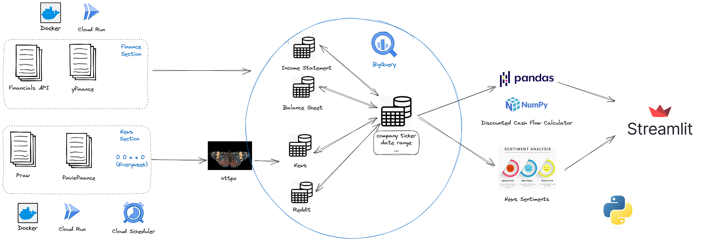

 Custom Discounted Cash Flow calculator  \
I want to make something to help me calculate DCF of a company faster

    

streamlit App for the Discounted Cash Flow calculator [App]()

App url : <>

## Data Pipeline
* APIs & Libraries:
    * Financial Statements: [https://discountingcashflows.com/]
    * Company info / stock beta / etc..: [yfinance](https://pypi.org/project/yfinance/)
    * News: yfinance / custom scraper
    * Reddit posts: [praw](https://praw.readthedocs.io/en/stable/)
    * Sentiment models []
* Database:
    * BigQuery

## pipeline architect

Tech stack & Cloud services:
* APIs
* Data warehouse: [BigQuery](https://cloud.google.com/bigquery)
* Scheduler: [Cloud_Scheduler](https://cloud.google.com/scheduler)
* Containers [CloudRun](https://cloud.google.com/run)

## note for my future self

* Python
    * Requests was being blocked by Yahoo, so I used httpx instead \
    beware of scrape rates

* Cloud
    * Bigquery mininum 10mb per table, so I should combine the financials into \
    one table
    
